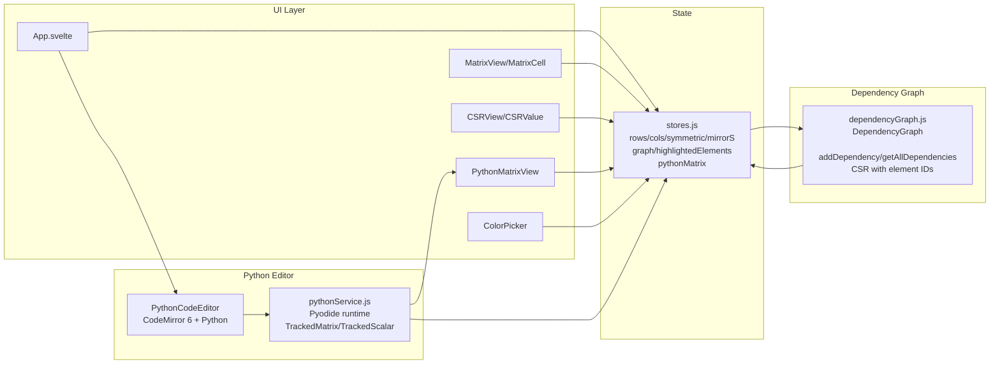

# Matrix Sparsity Inspector - Svelte Edition

A refactored Svelte application for visualizing sparse matrix multiplication with dependency tracking via a graph-based system.



## Architecture Overview

This application has been completely refactored from a single HTML file into a modular Svelte project with a sophisticated dependency graph system.

### Key Design Principles

1. **Graph-Based Dependency Tracking**: Every matrix element has a unique ID and tracks its dependencies through a directed acyclic graph (DAG)
2. **Reactive State Management**: Uses Svelte stores for reactive updates across all views
3. **Unified Highlighting System**: All views (matrix, CSR) use the same graph-based lookup for highlighting dependencies
4. **Extensible View System**: Easy to add new custom views that leverage the same dependency graph

## Project Structure

```
src/
├── lib/
│   ├── dependencyGraph.js    # Core dependency graph system with unique IDs
│   ├── stores.js              # Svelte stores for state management
│   ├── MatrixCell.svelte      # Individual matrix cell component
│   ├── MatrixView.svelte      # Matrix grid view component
│   ├── CSRValue.svelte        # CSR value element component
│   ├── CSRView.svelte         # CSR representation view
│   └── ColorPicker.svelte     # Color selection component
├── App.svelte                 # Main application component
├── app.css                    # Global styles
└── main.js                    # Application entry point
```

## Core Systems

### Python Runtime & Editor

- **Pyodide backend**: `pythonService.js` loads Pyodide, defines `TrackedMatrix`, `TrackedScalar`, and captures stdout/stderr.
- **TrackedScalar**: wraps scalars with dependency pairs (`left/right` sources) so manual algorithms using `K[i][j]` remain tracked.
- **TrackedMatrix.from_nested**: converts list-of-lists (numbers or tracked scalars) to a tracked matrix, so custom algorithms that build `O_py` manually still display correctly.
- **CodeMirror 6 editor**: `PythonCodeEditor.svelte` with Python highlighting, autocomplete for matrix symbols, error-line parsing, and hover tooltips.

### 1. Dependency Graph (`dependencyGraph.js`)

The heart of the application. Each matrix element is represented as a node with:

- **Unique ID**: Generated via `generateId()` 
- **Position**: `{matrixName, row, col}`
- **Value & Color**: Visual state
- **Dependencies**: Array of element IDs this element depends on
- **Dependents**: Array of element IDs that depend on this element

Key features:
- Bidirectional dependency tracking
- Efficient graph traversal for highlighting
- CSR representation generation with element IDs
- Matrix computation with automatic dependency establishment

### 2. State Management (`stores.js`)

Svelte stores provide reactive state:

- **Configuration stores**: `rows`, `cols`, `symmetric`, `mirrorS`, `currentColor`
- **Graph store**: Single source of truth for all matrix data
- **Highlighting store**: Currently highlighted element IDs
- **Derived stores**: Auto-computed views of matrix and CSR data

### 3. View Components

#### MatrixView & MatrixCell
- Renders matrix grids with paintable cells
- Shows mini-blocks for derived matrices (KS, O)
- Handles hover interactions via graph lookups

#### CSRView & CSRValue
- Displays Compressed Sparse Row representation
- Each value element linked to graph node
- Synchronized highlighting with matrix views

#### PythonMatrixView
- Renders the Python-computed `O_py` matrix returned from Pyodide
- Hover shows dependency highlights derived from `TrackedMatrix` dependencies

#### ColorPicker
- Preset color palette
- HTML5 color input integration

## Matrix Operations

The application computes: **O = S_left × K × S_right**

### Computation Flow

1. **User paints S_left, K, or S_right** → Updates graph nodes
2. **`computeKS()`** → Establishes dependencies: `KS[i][j]` depends on `K[i][t]` and `S_right[t][j]`
3. **`computeO()`** → Establishes dependencies: `O[i][j]` depends on `S_left[i][k]`, `KS[k][j]`, and transitively all KS dependencies

### Dependency Example

When `O[1][1]` is hovered:
1. Graph lookup finds all dependencies via `getAllDependencies()`
2. Returns Set of IDs including:
   - S_left elements in row 1
   - KS elements contributing to position [1,1]
   - K elements used to compute those KS elements
   - S_right elements used to compute those KS elements
3. All views simultaneously highlight these elements

## Highlighting System

**Before (HTML version)**: Manual DOM traversal, separate logic for each view

**After (Svelte version)**: 
```javascript
// Single function for all views
highlightElement(elementId) → 
  graph.getAllDependencies(elementId) → 
  highlightedElements.set(deps) → 
  All components reactively update
```

Benefits:
- Consistent highlighting across all current and future views
- Easy to add new views that automatically participate in highlighting
- No manual DOM manipulation
- Clean separation of concerns

## Adding New Views

To create a custom view (e.g., COO format, Graph visualization):

1. Create new Svelte component
2. Subscribe to `graph` and `highlightedElements` stores
3. Render elements using their IDs
4. Apply highlight class when `$highlightedElements.has(elementId)`
5. Call `highlightElement(id)` on interactions

Example:
```svelte
<script>
  import { graph, highlightedElements, highlightElement } from './stores';
  
  $: myView = computeMyView($graph);
</script>

{#each myView as item}
  <div 
    class:highlight={$highlightedElements.has(item.id)}
    on:mouseover={() => highlightElement(item.id)}
  >
    {item.data}
  </div>
{/each}
```

## Running the Application

```bash
# Install dependencies
npm install

# Development server
npm run dev

# Tests (unit)
npm run test

# Build for production
npm run build

# Preview production build
npm run preview
```

## Future Enhancements

Potential extensions enabled by this architecture:

- **COO (Coordinate) format view**: Trivial to add using graph IDs
- **Graph visualization**: Render dependency DAG using D3.js or similar
- **Performance profiling view**: Show which dependencies are "hot paths"
- **Custom matrix operations**: A×B×C×D with arbitrary depth
- **Animation**: Step-by-step visualization of matrix multiplication
- **Export/Import**: Save graph structure to JSON
- **Undo/Redo**: Stack of graph states

## Technical Details

- **Framework**: Svelte 4 + Vite
- **State Management**: Svelte stores (writable, derived)
- **Build Tool**: Vite for fast HMR and optimized builds
- **No external dependencies**: Pure Svelte and vanilla JS

Should you later need the extended capabilities and extensibility provided by SvelteKit, the template has been structured similarly to SvelteKit so that it is easy to migrate.

**Why include `.vscode/extensions.json`?**

Other templates indirectly recommend extensions via the README, but this file allows VS Code to prompt the user to install the recommended extension upon opening the project.

**Why enable `checkJs` in the JS template?**

It is likely that most cases of changing variable types in runtime are likely to be accidental, rather than deliberate. This provides advanced typechecking out of the box. Should you like to take advantage of the dynamically-typed nature of JavaScript, it is trivial to change the configuration.

**Why is HMR not preserving my local component state?**

HMR state preservation comes with a number of gotchas! It has been disabled by default in both `svelte-hmr` and `@sveltejs/vite-plugin-svelte` due to its often surprising behavior. You can read the details [here](https://github.com/sveltejs/svelte-hmr/tree/master/packages/svelte-hmr#preservation-of-local-state).

If you have state that's important to retain within a component, consider creating an external store which would not be replaced by HMR.

```js
// store.js
// An extremely simple external store
import { writable } from 'svelte/store'
export default writable(0)
```
